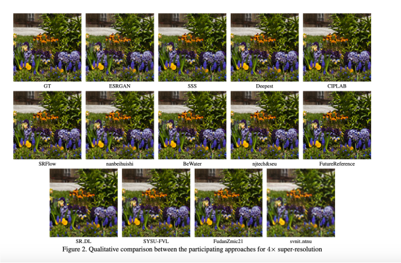
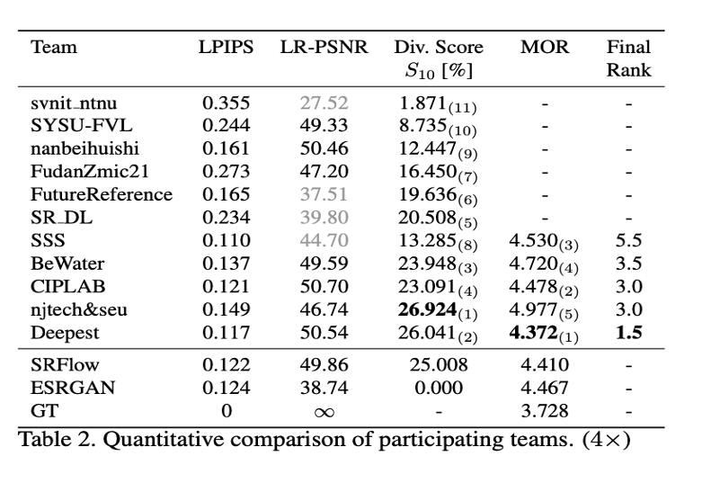
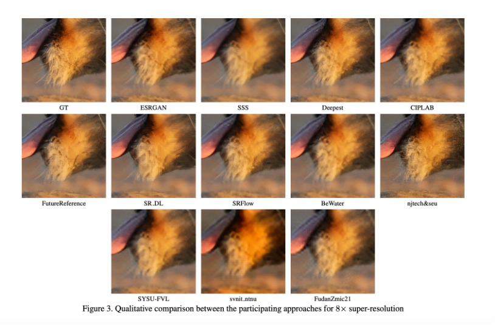
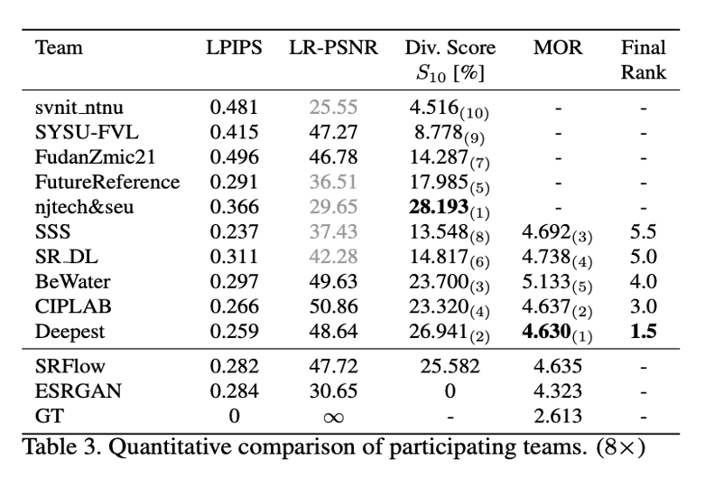

# NCSR: Noise Conditional Flow Model for Learning the Super-Resolution Space

Official NCSR training PyTorch Code for the CVPR2021 workshop paper "Noise Conditional Flow Model for Learning the Super-Resolution Space" 

**NCSR: Noise Conditional Flow Model for Learning the Super-Resolution Space**(https://arxiv.org/abs/2106.04428)

<div align="left">
  
  
</div>

<div align="left">
  
  
</div>
**We got 1st place in NTIRE2021 Learning the Super-Resolution Space. Our team name is Deepest

These figures and tables are from [NTIRE2021 Learning the Super-Resolution Space](https://openaccess.thecvf.com/content/CVPR2021W/NTIRE/papers/Lugmayr_NTIRE_2021_Learning_the_Super-Resolution_Space_Challenge_CVPRW_2021_paper.pdf)

## How to use repo
```.bash
git clone --recursive https://github.com/younggeun-kim/NCSR.git
```


## Training

```.bash
cd code
python train.py -opt path/to/Confpath
```
* path/to/Confpath is model parameter script which is in code/confs/~.yml

## Test

```.bash
cd code
python eval.py --scale scale_factor --lrtest_path path/to/LRpath --conf_path path/to/Confpath
```
* To eval with pretrained model, please check model_path in Confpath. 
* Pretriained models should be in code/pretrained_model

## Measure

```.bash
cd code/NTIRE21_Learning_SR_Space
python measure.py OutName path/to/Ground-Truth path/to/Super-Resolution n_samples scale_factor 
```
* path/to/Super-Resolution is code/output_dir. 

## Pretrained weight
[NCSR X4](https://drive.google.com/file/d/1I0oWgqHMQbYdJahT3GGziIfJnht-33to/view?usp=sharing)

[NCSR X8](https://drive.google.com/file/d/1R4QTAd4D6en6NOreqSY_mDObU6JNWXmM/view?usp=sharing)

RRDB pretrained weights can be found in [SRFlow github](https://github.com/andreas128/SRFlow)

## Preparing data
```.bash
cd code
python prepare_data.py /path/to/img_dir
```
* If dataset mode is LRHR_IMG, just use img_dir.
* If dataset mode is LRHR_PKL, please use this code.

## Citation
If you found our work useful, please don't forget to cite
```
@misc{kim2021noise,
      title={Noise Conditional Flow Model for Learning the Super-Resolution Space}, 
      author={Younggeun Kim and Donghee Son},
      year={2021},
      eprint={2106.04428},
      archivePrefix={arXiv},
      primaryClass={cs.CV}
}
```

The code is based on the [SRFlow implementation](https://github.com/andreas128/SRFlow)
